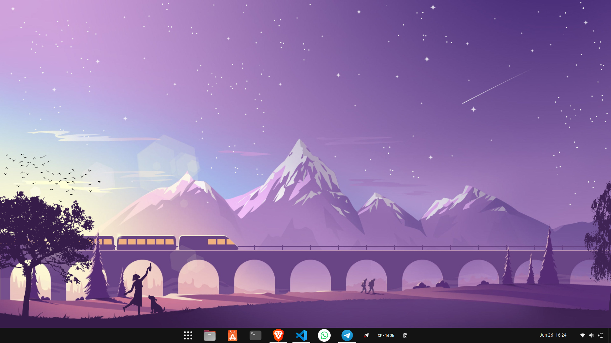
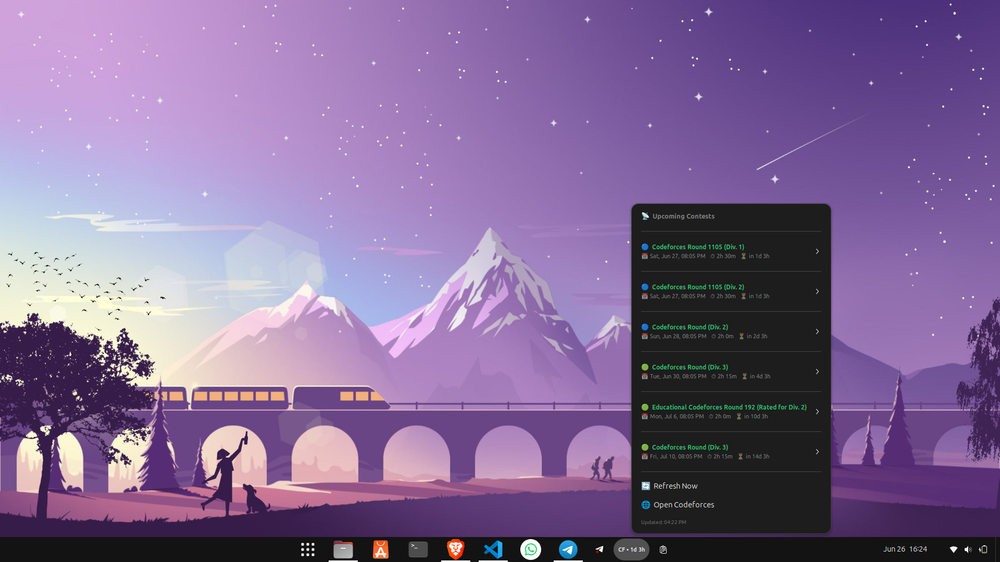
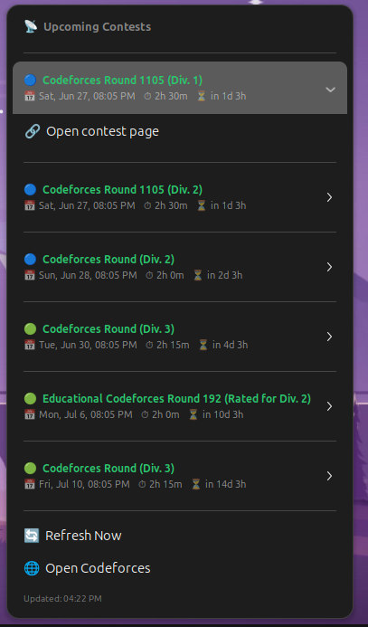
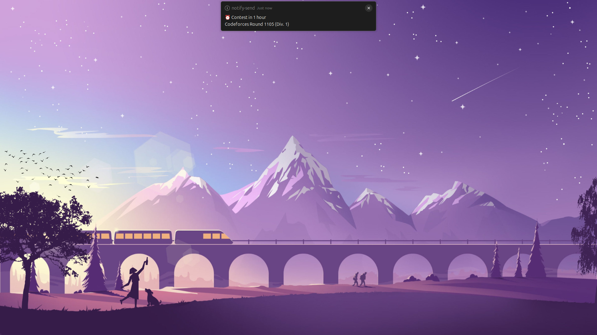

# CF Companion

A GNOME Shell extension for competitive programmers. Tracks upcoming Codeforces contests directly from your panel — live countdown, urgency colors, and desktop notifications. Optionally pairs with a Telegram bot for reminders and post-contest standings with friends.


---

## Screenshots

| Panel | Dropdown |
|---|---|
|  |  |

| Contest list | Notification |
|---|---|
|  |  |

---

## Features

### GNOME Extension

- **Live countdown** — panel label updates every minute showing time to next contest (`CF • 1d 3h`)
- **Urgency colors** — contest names shift green → yellow → orange → red as start time approaches
- **Desktop notifications** — fires at 1 hour before, 15 minutes before, and at contest start; no repeat notifications within a session
- **Offline mode** — keeps showing last known contests when network is unavailable, footer shows last update time

### Telegram Bot (optional)

- Register your Codeforces handle and track friends
- Morning digest with the day's contests
- Reminders 1 hour and 15 minutes before each contest
- Post-contest standings comparison with friends, sorted by rank

---

## Project Structure

```
cf-companion/
├── extension/
│   ├── extension.js       ← panel indicator, dropdown, fetch loop
│   ├── metadata.json      ← extension identity
│   ├── stylesheet.css     ← panel and menu styles
│   └── utils/
│       ├── time.js          ← countdown formatting, urgency colors
│       └── notifications.js ← desktop notification logic
│
├── backend/
│   ├── server.js          ← Express app + cron jobs
│   ├── bot.js             ← Telegram bot (long-polling)
│   ├── db.js              ← SQLite setup
│   ├── routes/
│   │   ├── users.js       ← user and friend management
│   │   └── contests.js    ← contest data endpoints
│   └── package.json
│
├── .github/workflows/     ← CI lint and validation
├── screenshots/
├── README.md
├── LICENSE
└── .gitignore
```

---

## How it works

```
Codeforces API ──► GNOME Extension (every 30 min, direct)
                        │
                        └── panel label, dropdown, desktop notifications

Codeforces API ──► Backend (cron, every 30 min)
                        │
                        └── Telegram Bot ──► your phone
                                                │
                                                ├── morning digest
                                                ├── contest reminders
                                                └── post-contest standings
```

The extension works fully standalone — the backend is only needed for Telegram features.

---

## Installing the Extension

```bash
git clone https://github.com/Tanishgehlot05/cf-companion.git
cd cf-companion

mkdir -p ~/.local/share/gnome-shell/extensions/cf-companion@Tanishgehlot05.github.io
cp -r extension/* ~/.local/share/gnome-shell/extensions/cf-companion@Tanishgehlot05.github.io/

gnome-extensions enable cf-companion@Tanishgehlot05.github.io
```

On Wayland, log out and back in after enabling. On X11, press `Alt+F2`, type `r`, press Enter.

---

## Running the Backend

```bash
cd backend
npm install
cp .env.example .env
# add your Telegram bot token to .env
npm start
```

Server runs on `http://localhost:3000`.

---

## Telegram Setup

1. Open Telegram and message `@BotFather`
2. Send `/newbot` — follow the steps to create a bot and get your token
3. Add the token to `backend/.env` as `TELEGRAM_BOT_TOKEN`
4. Start the backend and message your bot `/start`
5. Set your handle: `/add YourCFHandle`
6. Add friends: `/add FriendHandle`

### Commands

| Command | What it does |
|---|---|
| `/start` | Register your account |
| `/help` | Show all commands |
| `/add <handle>` | Set your handle (first time) or add a friend |
| `/remove <handle>` | Remove a friend |
| `/friends` | List your tracked friends |

---

## Debugging

```bash
# live extension logs
journalctl -f -o cat /usr/bin/gnome-shell

# reload after changes (X11 only)
gnome-extensions disable cf-companion@Tanishgehlot05.github.io
gnome-extensions enable cf-companion@Tanishgehlot05.github.io
```

---

## Planned

- Preferences page for refresh interval and contest count
- Contest type filter (Div. 1, Div. 2, Educational)
- Rating change display in post-contest standings
- Light theme support for urgency colors

---

## License

MIT — see [LICENSE](LICENSE).